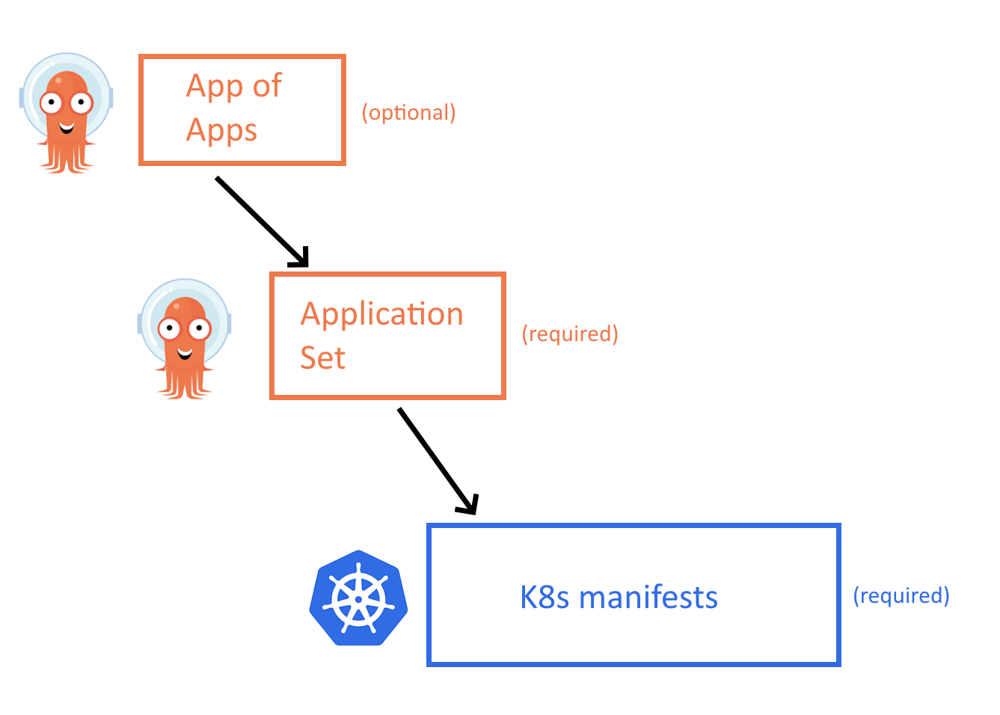
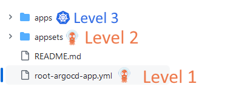

# How to structure your Argo CD repositories using Application Sets

This is an exaple repository for Organizing your applications with Argo CD.

## Best practice - Use the three level structure

The starting point should be a 3 level structure as shown in the image below

At the lowest level we have the Kubernetes manifests that define how the application runs (category 1 of manifests). These are your Kustomize or Helm templates and they are completely self-contained, meaning that they can be deployed on their own on any cluster even without Argo CD. We have covered in detail the structure of these files in the promotion blog post. 

One level above, we have the Application Set as explained in the previous section. These wrap the main Kubernetes manifests into Argo CD applications (category 2 of manifests). Notice that in most cases you only need ApplicationSets and not individual Application CRDs.

Last, as an optional component you can group all your application sets in an App-of-App that will help you bootstrap a completely empty cluster with all apps. This level might not be needed if you have a different way of creating clusters (i.e. with terraform/pulumi/crossplane) and this is why it is not really essential.

And that’s it!

Notice how simple this pattern is:

There are only 3 levels of abstraction. We have seen companies that have 4 or 5 making the mental model much more complex
Each level is completely independent of everything else. You can install the Kubernetes manifests on their own, or you can pick a specific application set or you can pick everything at the root. But it is your choice.
Helm and Kustomize are only used once at the Kubernetes manifests and nowhere else. This makes the templating system super easy to understand

Read the full blog post at https://codefresh.io/blog/how-to-structure-your-argo-cd-repositories-using-application-sets/

